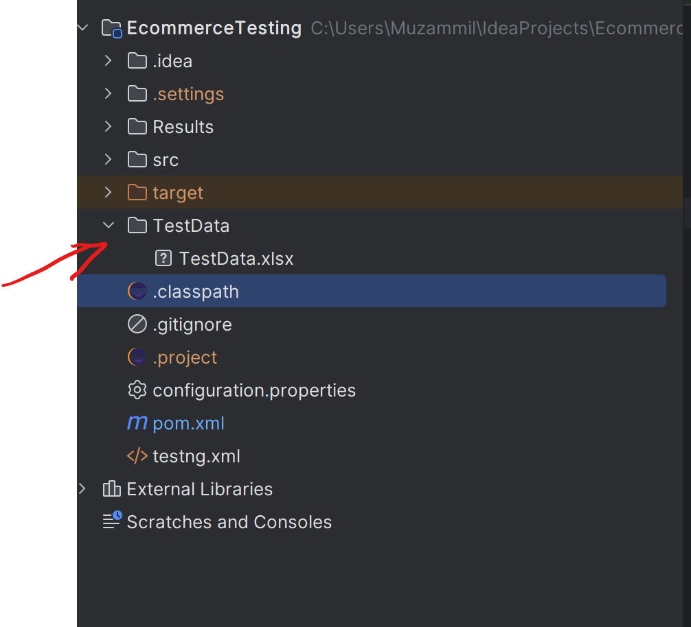
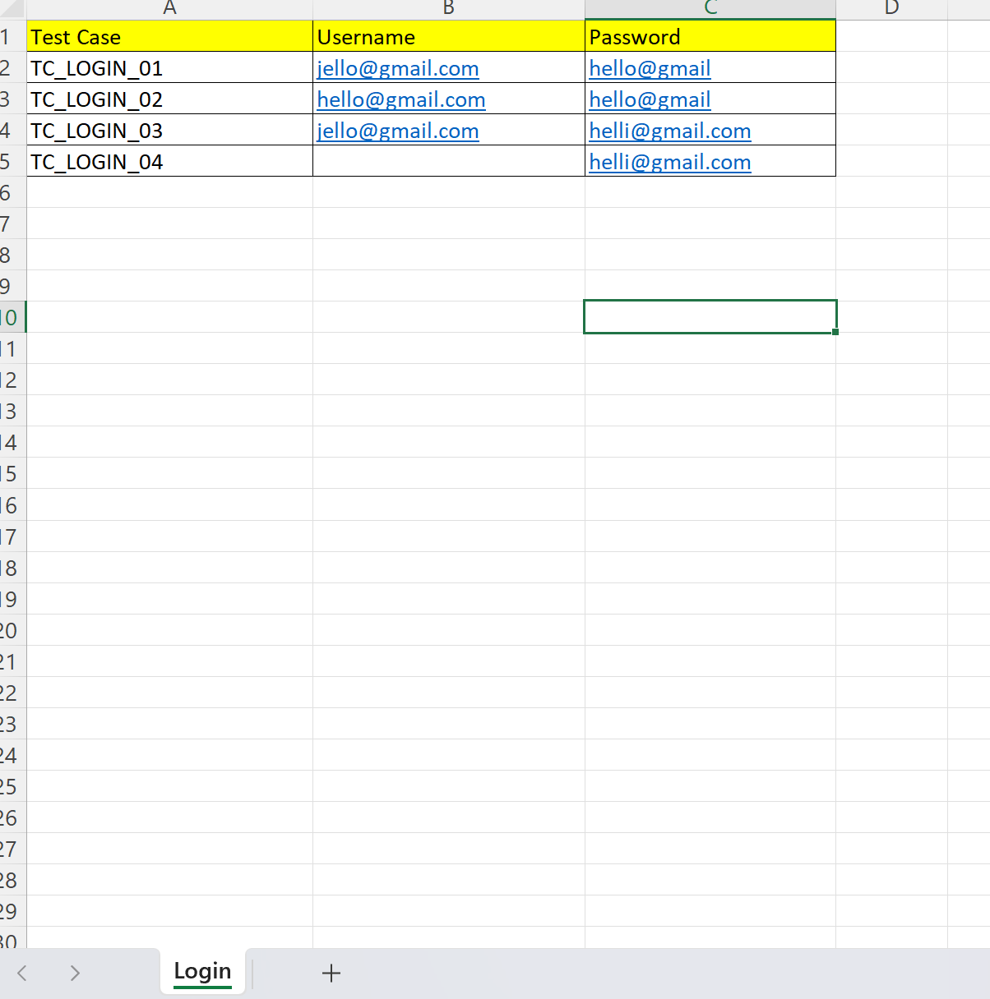

# Jexcel

## Description

This library is to make setting up and using test data in format of excel easy. It is developed by using apache.poi library functions to make more high level functions as you will see down in **usage** section

## Installation

1.Add the following dependancy to your POM.xml file of your project

```xml
<dependency>
  <groupId>com.muzammil</groupId>
  <artifactId>jexcel</artifactId>
  <version>0.0.1-SNAPSHOT</version>
</dependency>
```
2.Create TestData.xlsx file in your project directory


**Note:** Please note that you can save your excel file anywhere apart from the setup shown above you just need to send the path of the excel file in the paramter while creating an object of excellib class as shown in the next step. The aboce setup is default for it you dont have to share any path to the object to use the file.

3.Write import statment and create an object of excellib class as shown below
```java

import Jexcel.excellib;
public class loginTest {

  
    static excellib ex;
    @BeforeMethod
    public static void sessionSetup()
    {
      ....// along with all your setup code for the test
        ex=new excellib();

    }

```

4.Inside test methods of your test class you can use library functions as per your use
```java
@Test
    public static void invalidLogin()
    {
        ex.setTestData("Login","TC_LOGIN_02");
        l.enterUsername(ex.getTestData("Username"));
        l.enterPassword(ex.getTestData("Password"));
        l.clickLogin();
    }
```

## Usage

For understanding the usage please consider the below excel sheet.


### 1. setTestData() and getTestData()
Considering the above worksheet, you can use the combination of these two functions to make extracting test data more understandable and easy while writing your test scripts.

***setTestData()***

**Syntax**: objectName.setTestData("sheetName","testcaseName");

**usage**: This function creates a hashmap with column names as its keys and corresponding values related to the testcaseName as its values.

***getTestData()***

**Syntax**:objectName.getTestData("keyname");

**usage:** This function simply retrieves the value associated with that key in the hashmap created by the setTestData function.

**example:**

```java
@Test
    public static void invalidLogin()
    {
        ex.setTestData("Login","TC_LOGIN_02");
        l.enterUsername(ex.getTestData("Username"));
        l.enterPassword(ex.getTestData("Password"));
        l.clickLogin();
    }
```

### 2. getTestDataByCoordinates(String sheetName,int rowCount,int columnCount)
 
This function retrieves the test data based on coordinates passed as parameters such as the row number and column number. The return type of this function is string.

### 3. getColumnsCount(String sheetName):

Returns the number of columns present in the given sheet.

### 4. getRowsCount(String sheetName):

Returns the number of rows present in the given sheet.

### 5. getSheetsCount():

Returns the number of sheets present in the Excel file.

### 6. getSheetNames():
 
Returns a list of names of the sheets present in the Excel file.

**return type:** ArrayList

## Contributing

Pull requests are welcome. For major changes, please open an issue first
to discuss what you would like to change.

Please make sure to update tests as appropriate.

## License

[MIT](https://choosealicense.com/licenses/mit/)